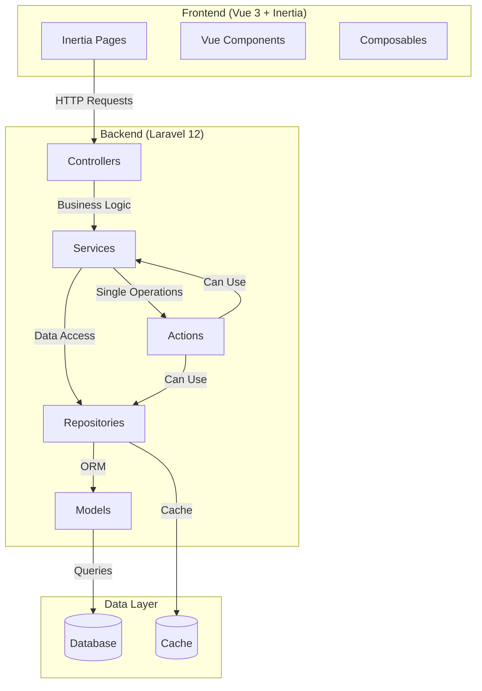
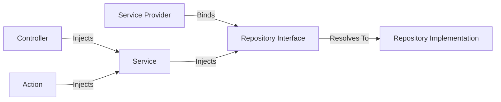
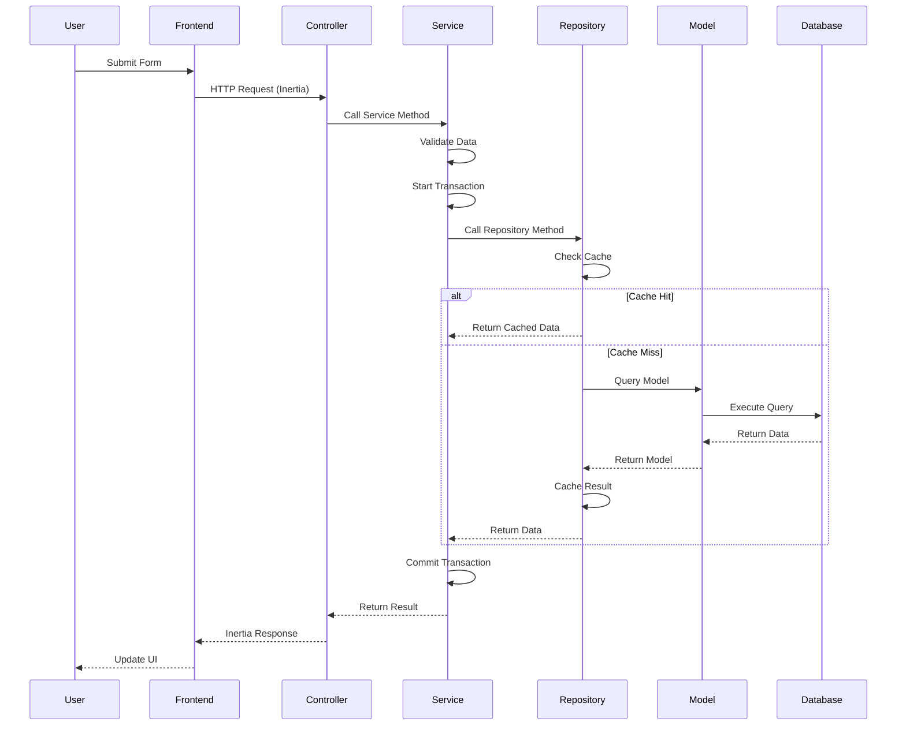

# CODEBASE.md

> **Generic Laravel Starter Kit** - A production-ready, reusable codebase template for building Laravel applications with Vue 3 and Inertia.js.

## Table of Contents

1. [Application Overview](#application-overview)
2. [Architecture Patterns](#architecture-patterns)
3. [Directory Structure](#directory-structure)
4. [Key Technologies & Versions](#key-technologies--versions)
5. [Authentication & Authorization](#authentication--authorization)
6. [Frontend Architecture](#frontend-architecture)
7. [Common Patterns & Examples](#common-patterns--examples)
8. [Data Flow Examples](#data-flow-examples)
9. [Performance Considerations](#performance-considerations)
10. [Security Best Practices](#security-best-practices)
11. [Troubleshooting](#troubleshooting)
12. [Critical Code Standards & Conventions](#critical-code-standards--conventions)
13. [Comprehensive File Inventory](#comprehensive-file-inventory)
14. [Development Workflow](#development-workflow)
15. [Tracking Changes](#tracking-changes)

---

## Application Overview

This is a **generic Laravel starter kit** designed to be cloned and customized for any Laravel project. It provides a solid foundation with:

- **Laravel 12** with PHP 8.4+, PHP 8.5+ support
- **Vue 3** with Composition API and TypeScript
- **Inertia.js 2** for seamless SPA experience + prefetch
- **Tailwind CSS 4** for utility-first styling
- **shadcn-vue** component library with Reka UI
- **Laravel Fortify** for authentication
- **Spatie Laravel Permission** for roles and permissions
- **Repository, Service, and Action patterns** for clean architecture

### Key Philosophy

- **Strict Typing**: All PHP files use `declare(strict_types=1);` and explicit return types
- **Clean Architecture**: Clear separation of concerns with Repository, Service, and Action patterns
- **Reusable Patterns**: Consistent patterns that can be applied across different projects
- **Code Quality**: Laravel Pint for PHP formatting, Prettier for frontend

### Quick Start Guide

**For New Developers**:

1. **Clone and Setup**:
   ```bash
   git clone <repository-url> your-project
   cd your-project
   composer run setup
   ```

2. **Start Development**:
   ```bash
   composer run dev
   ```
   This starts: Laravel server, queue worker, log viewer, and Vite dev server

3. **Access Application**:
   - Frontend: `http://localhost:8000`
   - Default user: Check `database/seeders/UserSeeder.php`

4. **Key Files to Understand First**:
   - `app/Repositories/AbstractRepository.php` - Repository pattern
   - `app/Services/AbstractService.php` - Service pattern
   - `app/Http/Controllers/DashboardController.php` - Simple controller example
   - `resources/js/pages/Dashboard.vue` - Simple page example

5. **Read This Documentation**:
   - Start with [Architecture Patterns](#architecture-patterns)
   - Review [Common Patterns & Examples](#common-patterns--examples)
   - Check [Development Workflow](#development-workflow) when adding features

---

## Architecture Patterns

This starter kit follows a clean architecture pattern with clear separation of concerns:

### Repository Pattern

**Location**: `app/Repositories/`

- **AbstractRepository**: Base repository with caching, CRUD operations, and query building
- **BaseRepository**: Extends AbstractRepository (if needed for additional base functionality)
- **RepositoryInterface**: Contract defining repository methods
- Repositories handle all database interactions and provide a clean abstraction layer
- Built-in caching with automatic invalidation on write operations

**Flow**: Controllers → Services → Repositories → Models

### Service Pattern

**Location**: `app/Services/`

- **AbstractService**: Base service with transaction support and validation helpers
- Services contain business logic and orchestrate repository operations
- Services can be easily tested and swapped without affecting controllers
- All operations use database transactions for data integrity

### Action Pattern

**Location**: `app/Actions/`

- Actions encapsulate single, focused business operations
- Actions are reusable and can be composed to build complex workflows
- Used for user management, authentication, and other domain operations
- Implements `ActionInterface` for consistency

### Layer Flow

```
HTTP Request
    ↓
Controller (handles HTTP, delegates to Service)
    ↓
Service (business logic, validation, transactions)
    ↓
Repository (data access, caching)
    ↓
Model (Eloquent ORM)
    ↓
Database
```

Actions can be used at any layer when a single-purpose operation is needed.

### Architecture Diagram



### Dependency Injection Flow



**Example**:
- `RepositoryServiceProvider` binds `UserRepositoryInterface` → `UserRepository`
- `UserService` constructor receives `UserRepositoryInterface` (auto-resolved)
- `Controller` receives `UserService` (auto-resolved)

---

## Directory Structure

### Backend Structure

```
app/
├── Actions/              # Single-purpose business operations
│   ├── Fortify/         # Authentication actions
│   └── User/            # User management actions
├── Constants/           # Application constants (e.g., RoleNames)
├── Contracts/           # Interfaces (Repository, Service, Action)
│   ├── Actions/
│   ├── Repositories/
│   └── Services/
├── Facades/             # Application-specific facades
├── Http/
│   ├── Controllers/    # HTTP controllers
│   │   ├── Admin/      # Admin panel controllers
│   │   └── Settings/   # User settings controllers
│   ├── Middleware/     # Custom middleware
│   └── Requests/        # Form request validation
│       ├── Admin/
│       └── Settings/
├── Listeners/           # Event listeners
├── Models/              # Eloquent models
├── Providers/           # Service providers
├── Repositories/        # Data access layer
├── Services/            # Business logic layer
├── SettingRole.php     # Setting role enum
└── Traits/              # Reusable traits
```

### Frontend Structure

```
resources/js/
├── actions/             # Wayfinder-generated route actions
├── components/          # Reusable Vue components (shadcn-vue)
├── composables/         # Vue composition functions
├── layouts/             # Inertia layout components
│   ├── admin/
│   ├── app/
│   ├── auth/
│   └── settings/
├── pages/               # Inertia page components
│   ├── admin/
│   ├── auth/
│   └── settings/
├── routes/              # Wayfinder-generated routes
├── types/               # TypeScript type definitions
├── app.ts              # Main application entry point
└── ssr.ts              # SSR entry point
```

### Test Structure

```
tests/
├── Feature/             # Feature tests (HTTP endpoints)
└── Unit/                # Unit tests (individual classes)
    ├── Actions/
    ├── Repositories/
    └── Services/
```

---

## Environment Setup

### Prerequisites

- **PHP 8.4+** or **PHP 8.5+** with extensions:
  - BCMath, Ctype, cURL, DOM, Fileinfo, JSON, Mbstring, OpenSSL, PCRE, PDO, Tokenizer, XML
- **Composer** (latest version)
- **Node.js 18+** and npm
- **SQLite** (default) or MySQL/PostgreSQL
- **Git**

### Initial Setup

1. **Clone Repository**:
   ```bash
   git clone <repository-url> your-project-name
   cd your-project-name
   ```

2. **Install Dependencies**:
   ```bash
   composer install
   npm install
   ```

3. **Environment Configuration**:
   ```bash
   cp .env.example .env
   php artisan key:generate
   ```

4. **Database Setup**:
   ```bash
   # For SQLite (default)
   touch database/database.sqlite

   # For MySQL/PostgreSQL, update .env:
   # DB_CONNECTION=mysql
   # DB_HOST=127.0.0.1
   # DB_PORT=3306
   # DB_DATABASE=your_database
   # DB_USERNAME=your_username
   # DB_PASSWORD=your_password
   ```

5. **Run Migrations & Seeders**:
   ```bash
   php artisan migrate --seed
   ```

6. **Build Frontend Assets**:
   ```bash
   npm run build
   ```

### Development Environment

**Start All Services**:
```bash
composer run dev
```

This command runs concurrently:
- Laravel development server (`php artisan serve`)
- Queue worker (`php artisan queue:listen`)
- Log viewer (`php artisan pail`)
- Vite dev server (`npm run dev`)

**Access Points**:
- Application: `http://localhost:8000`
- Logs: View in terminal (Pail)
- Hot Reload: Automatic with Vite

### Production Environment

1. **Optimize**:
   ```bash
   php artisan config:cache
   php artisan route:cache
   php artisan view:cache
   composer install --optimize-autoloader --no-dev
   npm run build
   ```

2. **Environment Variables**:
   - Set `APP_ENV=production`
   - Set `APP_DEBUG=false`
   - Configure production database
   - Set up queue workers
   - Configure cache driver (Redis recommended)

### Environment Variables Reference

**Key Variables**:
```env
APP_NAME="Your App Name"
APP_ENV=local
APP_DEBUG=true
APP_URL=http://localhost:8000

DB_CONNECTION=sqlite
DB_DATABASE=database/database.sqlite

MAIL_MAILER=log
QUEUE_CONNECTION=sync

CACHE_DRIVER=file
SESSION_DRIVER=file
```

---

## Key Technologies & Versions

### Backend

- **Laravel 12** - PHP framework
- **PHP 8.4+** - Programming language (strict types required)
- **Laravel Fortify** - Headless authentication backend
- **Spatie Laravel Permission** - Roles and permissions management (core dependency)
- **Laravel Wayfinder** - Type-safe route generation
- **Inertia.js Laravel** - Server-side adapter

### Frontend

- **Vue 3** - Progressive JavaScript framework
- **TypeScript** - Type-safe JavaScript
- **Inertia.js Vue3** - Client-side adapter
- **Tailwind CSS 4** - Utility-first CSS framework
- **shadcn-vue** - Component library
- **Reka UI** - Headless UI components
- **Lucide Vue** - Icon library
- **VueUse** - Vue composition utilities

### Development Tools

- **Vite** - Build tool and dev server
- **ESLint** - Code linting
- **Prettier** - Code formatting
- **TypeScript ESLint** - TypeScript linting
- **Laravel Pint** - PHP code style fixer (required)
- **Laravel Pail** - Real-time log viewer
- **Laravel Debugbar** - Development debugging toolbar
- **PHPUnit** - Testing framework

---

## Authentication & Authorization

### Laravel Fortify

Fortify provides headless authentication with the following features:

- User registration (can be enabled/disabled via settings)
- Login/logout
- Password reset via email
- Email verification
- Two-factor authentication (2FA) with QR codes and recovery codes
- Password confirmation

**Configuration**: `app/Providers/FortifyServiceProvider.php`

### Spatie Laravel Permission

**Core dependency** for roles and permissions management:

- **Role-based access control (RBAC)**: Users have roles (super-admin, admin, user)
- **Permission-based authorization**: Fine-grained permissions
- **Default Roles**:
  - `super-admin`: Has all permissions automatically (via Gate::before)
  - `admin`: Administrative role
  - `user`: Standard user role

**Configuration**: `app/Providers/AuthServiceProvider.php`

The super-admin role is special - it automatically has all permissions via `Gate::before()` and should not be deleted or renamed.

### Cookie Consent & GDPR

- Cookie consent preferences stored per user
- Data processing consent tracking
- GDPR-compliant cookie and privacy policy pages

---

## Frontend Architecture

### Inertia.js Pages

**Location**: `resources/js/pages/`

Pages are organized by feature:
- `auth/` - Authentication pages (login, register, password reset, etc.)
- `admin/` - Admin panel pages
- `settings/` - User settings pages
- Root level - Public pages (Welcome, Dashboard, etc.)

### Vue Components

**Location**: `resources/js/components/`

Reusable Vue components built with shadcn-vue and Reka UI. Components follow the shadcn-vue pattern.

### Layouts

**Location**: `resources/js/layouts/`

- `AppLayout.vue` - Main application layout
- `PublicLayout.vue` - Public-facing pages layout
- `AuthLayout.vue` - Authentication pages layout
- `admin/AdminLayout.vue` - Admin panel layout
- `app/AppHeaderLayout.vue` - App header layout
- `app/AppSidebarLayout.vue` - App sidebar layout
- `auth/` - Various auth page layouts
- `settings/Layout.vue` - Settings pages layout

### Composables

**Location**: `resources/js/composables/`

Reusable Vue composition functions:
- `useAppearance.ts` - Theme/appearance management
- `useCookieConsent.ts` - Cookie consent handling
- `useInitials.ts` - User initials generation
- `useTwoFactorAuth.ts` - 2FA functionality

### TypeScript Types

**Location**: `resources/js/types/`

Type definitions for pages, models, and forms to ensure type safety across the frontend.

### Wayfinder

Laravel Wayfinder generates TypeScript functions and types for Laravel routes, providing type-safe route generation on the frontend.

#### Wayfinder Usage Examples

**Importing Routes**:
```typescript
// Import controller methods (tree-shakable)
import { show, store, update } from '@/actions/App/Http/Controllers/PostController'

// Import named routes
import { show as postShow } from '@/routes/post'
```

**Using Routes**:
```typescript
// Get route object with URL and method
show(1) // { url: "/posts/1", method: "get" }

// Get just the URL
show.url(1) // "/posts/1"

// Use specific HTTP methods
show.get(1) // { url: "/posts/1", method: "get" }
show.head(1) // { url: "/posts/1", method: "head" }

// With query parameters
show(1, { query: { page: 1 } }) // "/posts/1?page=1"

// Merge with current query
show(1, { mergeQuery: { page: 2, sort: null } })
```

**With Inertia Form Component**:
```vue
<template>
  <Form v-bind="store.form()">
    <input name="title" />
    <button type="submit">Create</button>
  </Form>
</template>

<script setup lang="ts">
import { Form } from '@inertiajs/vue3'
import { store } from '@/actions/App/Http/Controllers/PostController'
</script>
```

**Generate Wayfinder Types**:
```bash
php artisan wayfinder:generate
```

---

## Common Patterns & Examples

### Repository Pattern Example

**Creating a New Repository**:

```php
<?php

declare(strict_types=1);

namespace App\Repositories;

use App\Contracts\Repositories\PostRepositoryInterface;
use App\Models\Post;

final class PostRepository extends BaseRepository implements PostRepositoryInterface
{
    public function __construct()
    {
        parent::__construct(Post::class);
    }

    public function findBySlug(string $slug): ?Post
    {
        return $this->query()
            ->where('slug', $slug)
            ->first();
    }

    public function getPublished(): \Illuminate\Database\Eloquent\Collection
    {
        return $this->query()
            ->where('published', true)
            ->orderBy('created_at', 'desc')
            ->get();
    }
}
```

**Register in Service Provider**:
```php
// app/Providers/RepositoryServiceProvider.php
public array $bindings = [
    PostRepositoryInterface::class => PostRepository::class,
    // ... other bindings
];
```

### Service Pattern Example

**Creating a New Service**:

```php
<?php

declare(strict_types=1);

namespace App\Services;

use App\Contracts\Repositories\PostRepositoryInterface;
use App\Contracts\Services\PostServiceInterface;
use App\Models\Post;

final class PostService extends AbstractService implements PostServiceInterface
{
    public function __construct(PostRepositoryInterface $repository)
    {
        parent::__construct($repository);
    }

    public function create(array $data): Post
    {
        $validated = $this->validate($data, [
            'title' => ['required', 'string', 'max:255'],
            'content' => ['required', 'string'],
            'slug' => ['required', 'string', 'unique:posts,slug'],
        ]);

        return $this->transaction(fn () => $this->getRepository()->create($validated));
    }

    public function publish(int $postId): bool
    {
        return $this->transaction(function () use ($postId) {
            $post = $this->getRepository()->findOrFail($postId);
            return $this->getRepository()->update($post->id, [
                'published' => true,
                'published_at' => now(),
            ]);
        });
    }
}
```

### Action Pattern Example

**Creating a New Action**:

```php
<?php

declare(strict_types=1);

namespace App\Actions\Post;

use App\Contracts\Actions\ActionInterface;
use App\Contracts\Services\PostServiceInterface;
use App\Models\Post;

final class PublishPostAction implements ActionInterface
{
    public function __construct(
        private readonly PostServiceInterface $postService
    ) {}

    public function handle(mixed ...$parameters): bool
    {
        $postId = $parameters[0] ?? null;

        if (!is_int($postId)) {
            throw new \InvalidArgumentException('Post ID must be an integer');
        }

        return $this->postService->publish($postId);
    }
}
```

### Form Request Example

**Creating a Form Request**:

```php
<?php

declare(strict_types=1);

namespace App\Http\Requests\Admin;

use App\Http\Requests\AbstractFormRequest;

final class StorePostRequest extends AbstractFormRequest
{
    public function rules(): array
    {
        return [
            'title' => ['required', 'string', 'max:255'],
            'content' => ['required', 'string'],
            'slug' => ['required', 'string', 'unique:posts,slug'],
        ];
    }

    public function messages(): array
    {
        return [
            'title.required' => 'The post title is required.',
            'content.required' => 'The post content is required.',
        ];
    }
}
```

### Controller Example

**Creating a Controller**:

```php
<?php

declare(strict_types=1);

namespace App\Http\Controllers\Admin;

use App\Contracts\Services\PostServiceInterface;
use App\Http\Controllers\Controller;
use App\Http\Requests\Admin\StorePostRequest;
use Illuminate\Http\RedirectResponse;
use Inertia\Inertia;
use Inertia\Response;

final class PostsController extends Controller
{
    public function __construct(
        private readonly PostServiceInterface $postService
    ) {}

    public function index(): Response
    {
        $posts = $this->postService->getAll();

        return Inertia::render('admin/Posts/Index', [
            'posts' => $posts,
        ]);
    }

    public function store(StorePostRequest $request): RedirectResponse
    {
        $post = $this->postService->create($request->validated());

        return redirect()
            ->route('admin.posts.index')
            ->with('success', 'Post created successfully.');
    }
}
```

### Frontend Page Example

**Creating an Inertia Page**:

```vue
<template>
  <AppLayout title="Posts">
    <div>
      <h1>Posts</h1>
      <Form v-bind="store.form()" @submit="submit">
        <input v-model="form.title" name="title" />
        <textarea v-model="form.content" name="content" />
        <button type="submit" :disabled="form.processing">
          Create Post
        </button>
      </Form>
    </div>
  </AppLayout>
</template>

<script setup lang="ts">
import { Form } from '@inertiajs/vue3'
import { store } from '@/actions/App/Http/Controllers/Admin/PostsController'
import AppLayout from '@/layouts/AppLayout.vue'

defineProps<{
  posts: Array<{
    id: number
    title: string
    content: string
  }>
}>()

const form = store.form()

const submit = () => {
  form.post(store.url())
}
</script>
```

### Testing Example

**Feature Test**:

```php
<?php

declare(strict_types=1);

namespace Tests\Feature;

use App\Models\User;
use Tests\TestCase;
use Illuminate\Foundation\Testing\RefreshDatabase;

final class PostTest extends TestCase
{
    use RefreshDatabase;

    public function test_user_can_create_post(): void
    {
        $user = User::factory()->create();

        $response = $this->actingAs($user)
            ->post(route('admin.posts.store'), [
                'title' => 'Test Post',
                'content' => 'Test content',
                'slug' => 'test-post',
            ]);

        $response->assertRedirect(route('admin.posts.index'));
        $this->assertDatabaseHas('posts', [
            'title' => 'Test Post',
            'user_id' => $user->id,
        ]);
    }
}
```

**Unit Test**:

```php
<?php

declare(strict_types=1);

namespace Tests\Unit\Services;

use App\Repositories\PostRepository;
use App\Services\PostService;
use App\Models\Post;
use Tests\TestCase;
use Mockery;

final class PostServiceTest extends TestCase
{
    public function test_create_post(): void
    {
        $repository = Mockery::mock(PostRepository::class);
        $repository->shouldReceive('create')
            ->once()
            ->andReturn(new Post(['title' => 'Test']));

        $service = new PostService($repository);
        $post = $service->create(['title' => 'Test']);

        $this->assertInstanceOf(Post::class, $post);
    }
}
```

---

## Data Flow Examples

### Example: Creating a User

1. **Frontend** (`resources/js/pages/admin/Users/Create.vue`)
   - User fills out form
   - Submits via Inertia form

2. **Route** (`routes/web.php`)
   - Routes to `Admin\UsersController@store`

3. **Controller** (`app/Http/Controllers/Admin/UsersController.php`)
   - Receives request
   - Validates via Form Request (`StoreUserRequest`)
   - Calls `UserService::create()`

4. **Service** (`app/Services/UserService.php`)
   - Validates data
   - Starts database transaction
   - Calls `UserRepository::createUser()`

5. **Repository** (`app/Repositories/UserRepository.php`)
   - Extends `BaseRepository`
   - Calls `AbstractRepository::create()`
   - Clears cache automatically

6. **Model** (`app/Models/User.php`)
   - Eloquent creates record
   - Returns User instance

7. **Response**
   - Service returns User
   - Controller returns Inertia response
   - Frontend receives updated data

### Example: Authentication Flow

1. User submits login form
2. Fortify handles authentication (`app/Providers/FortifyServiceProvider.php`)
3. On success, user is authenticated
4. `HandleInertiaRequests` middleware shares user data with frontend
5. Frontend receives user, roles, and permissions in shared props

### Data Flow Diagram



---

## Critical Code Standards & Conventions

### PHP 8.4+ Strict Types

**REQUIRED**: All PHP files MUST declare strict types at the top:

```php
<?php

declare(strict_types=1);

namespace App\Example;

// ... rest of file
```

### Explicit Return Types

**REQUIRED**: ALL methods and functions MUST have explicit return type declarations:

```php
// ✅ Good
public function findById(int $id): ?User
{
    // ...
}

// ❌ Bad
public function findById($id)
{
    // ...
}
```

### Constructor Property Promotion

Use PHP 8 constructor property promotion where applicable:

```php
// ✅ Good
public function __construct(
    private readonly UserServiceInterface $userService
) {}

// ❌ Bad
private UserServiceInterface $userService;

public function __construct(UserServiceInterface $userService)
{
    $this->userService = $userService;
}
```

### Laravel Pint

**REQUIRED**: Code MUST be formatted with Pint before committing:

```bash
# Format only changed files
vendor/bin/pint --dirty

# Format all files
vendor/bin/pint
```

### Repository Pattern

- **Always** use repositories for data access
- **Never** use direct model queries in controllers
- Controllers should call Services, not Repositories directly
- Services use Repositories for data access

### Service Pattern

- Business logic goes in Services, not Controllers
- Services orchestrate Repository operations
- Services handle validation and transactions

### Form Request Validation

- **Always** use Form Request classes for validation
- **Never** use inline validation in controllers
- Form Requests extend `AbstractFormRequest`

### Testing Requirements

- All changes must have corresponding tests
- Feature tests for HTTP endpoints
- Unit tests for individual classes
- Run tests before committing: `php artisan test`

### Code Formatting

- **PHP**: Laravel Pint (`vendor/bin/pint --dirty`)
- **Frontend**: Prettier (`npm run format`)

---

## Comprehensive File Inventory

This section documents every important file in the codebase, organized by category. Use this as a reference when implementing new features.

> **Note on Dates**: To track when files were created or modified, use `git log --follow <file>` or check file modification dates. When adding new features, update this documentation.

### 9.1 Core Architecture Files

#### Abstract Classes & Interfaces

**`app/Contracts/RepositoryInterface.php`**
- Base repository interface defining CRUD operations
- All repositories must implement this interface
- Provides type-safe contract for data access layer

**`app/Repositories/AbstractRepository.php`**
- Base repository implementation with caching
- Provides: `find()`, `findOrFail()`, `create()`, `update()`, `delete()`, `all()`, `paginate()`
- Automatic cache invalidation on write operations
- Cache TTL: 3600 seconds (1 hour) by default

**`app/Repositories/BaseRepository.php`**
- Extends AbstractRepository (if additional base functionality is needed)
- Check this file for any base repository extensions

**`app/Contracts/Actions/ActionInterface.php`**
- Base action contract for single-purpose operations
- All actions must implement `handle()` method

**`app/Services/AbstractService.php`**
- Base service implementation
- Provides: `transaction()`, `validate()`, `getRepository()`
- All services extend this class

**`app/Http/Requests/AbstractFormRequest.php`**
- Base form request class
- Provides common validation structure
- All form requests extend this class

#### Service Providers

**`app/Providers/AppServiceProvider.php`**
- Main application service provider
- Register application services here

**`app/Providers/AuthServiceProvider.php`**
- Authentication and authorization configuration
- **Critical**: Grants super-admin role all permissions via `Gate::before()`
- Policy mappings

**`app/Providers/FortifyServiceProvider.php`**
- Laravel Fortify configuration
- Configures authentication views (Inertia pages)
- Configures authentication actions
- Configures rate limiting
- Checks registration enabled setting

**`app/Providers/RepositoryServiceProvider.php`**
- Repository interface bindings
- Registers repository implementations in service container
- Add new repository bindings here

#### Bootstrap Files

**`bootstrap/app.php`**
- Laravel 12 application bootstrap
- Registers middleware, exceptions, and routing
- No `app/Http/Kernel.php` in Laravel 12

**`bootstrap/providers.php`**
- Application-specific service providers registration

### 9.2 Repository Layer Files

**`app/Contracts/Repositories/UserRepositoryInterface.php`**
- User repository interface
- Extends `RepositoryInterface`
- Defines user-specific methods: `findByEmail()`, `findById()`, `createUser()`, `updateUser()`, `deleteUser()`, `updatePassword()`, `search()`, `getAllForImpersonation()`

**`app/Repositories/UserRepository.php`**
- User repository implementation
- Extends `BaseRepository`
- Implements `UserRepositoryInterface`
- Provides user-specific data access methods

**`app/Contracts/Repositories/SettingsRepositoryInterface.php`**
- Settings repository interface
- Defines methods: `get()`, `set()`, `has()`

**`app/Repositories/SettingRepository.php`**
- Settings repository implementation
- Extends `BaseRepository`
- Implements `SettingsRepositoryInterface`
- Handles JSON encoding/decoding for complex values
- Converts booleans to strings for database storage

### 9.3 Service Layer Files

**`app/Contracts/Services/UserServiceInterface.php`**
- User service interface
- Defines business logic methods: `create()`, `updateProfile()`, `updatePassword()`, `delete()`, `findById()`, `findByEmail()`

**`app/Services/UserService.php`**
- User service implementation
- Extends `AbstractService`
- Implements `UserServiceInterface`
- Handles user creation, profile updates, password changes, account deletion
- Uses transactions for data integrity
- Validates data before operations

### 9.4 Action Classes

#### Fortify Actions

**`app/Actions/Fortify/CreateNewUser.php`**
- Handles user registration via Fortify
- Creates new user account
- Used by Fortify during registration

**`app/Actions/Fortify/PasswordValidationRules.php`**
- Defines password validation rules
- Used across the application for consistent password requirements

**`app/Actions/Fortify/ResetUserPassword.php`**
- Handles password reset via Fortify
- Updates user password during password reset flow

#### User Actions

**`app/Actions/User/CreateUserAction.php`**
- Action for creating a user
- Uses `UserService` to create user
- Implements `ActionInterface`

**`app/Actions/User/DeleteUserAction.php`**
- Action for deleting a user
- Uses `UserService` to delete user

**`app/Actions/User/UpdateUserPasswordAction.php`**
- Action for updating user password
- Uses `UserService` to update password

**`app/Actions/User/UpdateUserProfileAction.php`**
- Action for updating user profile
- Uses `UserService` to update profile

### 9.5 Controllers

#### Base Controller

**`app/Http/Controllers/Controller.php`**
- Base controller class
- All controllers extend this

#### Public Controllers

**`app/Http/Controllers/DashboardController.php`**
- Displays authenticated user's dashboard
- Requires authentication and email verification
- Renders `Dashboard` Inertia page

**`app/Http/Controllers/AboutController.php`**
- Handles about page
- Renders `About` Inertia page

**`app/Http/Controllers/CookieConsentController.php`**
- Handles cookie consent preferences
- Methods: `getPreferences()`, `updatePreferences()`, `acceptAll()`, `rejectAll()`

**`app/Http/Controllers/ImpersonateController.php`**
- Handles user impersonation
- Methods: `index()` (list users), `store()` (start impersonation), `destroy()` (stop impersonation)

#### Admin Controllers

**`app/Http/Controllers/Admin/AdminController.php`**
- Admin panel dashboard/home

**`app/Http/Controllers/Admin/UsersController.php`**
- User management in admin panel
- Methods: `index()`, `create()`, `store()`

**`app/Http/Controllers/Admin/RolesController.php`**
- Role management in admin panel
- Methods: `index()`, `create()`, `store()`, `edit()`, `update()`, `destroy()`

**`app/Http/Controllers/Admin/PermissionsController.php`**
- Permission management in admin panel
- Methods: `index()`, `create()`, `store()`, `edit()`, `update()`

**`app/Http/Controllers/Admin/SettingsController.php`**
- Application settings management
- Methods: `index()`, `create()`, `store()`, `edit()`, `update()`, `destroy()`, `bulkUpdate()`

**`app/Http/Controllers/Admin/DatabaseController.php`**
- Database browser/explorer
- Methods: `index()`, `listConnections()`, `show()` (table/view details)

#### Settings Controllers

**`app/Http/Controllers/Settings/ProfileController.php`**
- User profile settings
- Methods: `edit()`, `update()`, `destroy()` (delete account)

**`app/Http/Controllers/Settings/PasswordController.php`**
- User password change
- Methods: `edit()`, `update()`

**`app/Http/Controllers/Settings/TwoFactorAuthenticationController.php`**
- 2FA management
- Methods: `show()` (enable/disable 2FA)

**`app/Http/Controllers/Settings/RegistrationController.php`**
- Registration settings (enable/disable registration)

### 9.6 Form Requests

#### Base Form Request

**`app/Http/Requests/AbstractFormRequest.php`**
- Base form request class
- Provides common validation structure
- All form requests extend this

#### Admin Form Requests

**`app/Http/Requests/Admin/StoreUserRequest.php`**
- Validates user creation in admin panel

**`app/Http/Requests/Admin/StoreRoleRequest.php`**
- Validates role creation

**`app/Http/Requests/Admin/UpdateRoleRequest.php`**
- Validates role updates

**`app/Http/Requests/Admin/StorePermissionRequest.php`**
- Validates permission creation

**`app/Http/Requests/Admin/UpdatePermissionRequest.php`**
- Validates permission updates

**`app/Http/Requests/Admin/SettingStoreRequest.php`**
- Validates setting creation

**`app/Http/Requests/Admin/SettingsUpdateRequest.php`**
- Validates setting updates

#### Settings Form Requests

**`app/Http/Requests/Settings/ProfileUpdateRequest.php`**
- Validates profile updates

**`app/Http/Requests/Settings/PasswordUpdateRequest.php`**
- Validates password changes

**`app/Http/Requests/Settings/TwoFactorAuthenticationRequest.php`**
- Validates 2FA operations

**`app/Http/Requests/Settings/RegistrationSettingRequest.php`**
- Validates registration setting changes

#### Other Form Requests

**`app/Http/Requests/UpdateCookieConsentRequest.php`**
- Validates cookie consent preferences

### 9.7 Models

**`app/Models/User.php`**
- User Eloquent model
- Uses traits: `HasFactory`, `HasRoles` (Spatie), `Notifiable`, `TracksLastLogin`, `TwoFactorAuthenticatable`
- Fillable: name, email, password, cookie consent fields, data processing consent, last_login_at
- Methods: `getFullNameAttribute()`, `getInitialsAttribute()`, `hasCookieConsent()`, `hasDataProcessingConsent()`, `hasCookieConsentForCategory()`, `updateCookieConsent()`, `updateDataProcessingConsent()`

**`app/Models/Setting.php`**
- Setting Eloquent model
- Stores application settings (key-value pairs)
- Fillable: key, value, field_type, options, label, description, role
- Casts: `role` to `SettingRole` enum, `options` to array
- Static methods: `get()`, `set()`

#### Traits

**`app/Traits/TracksLastLogin.php`**
- Trait for tracking last login timestamp
- Methods: `recordLastLogin()`, `hasLoggedIn()`
- Used by User model

#### Enums

**`app/SettingRole.php`**
- Enum for setting roles (determines who can view/edit settings)
- Used by Setting model

#### Constants

**`app/Constants/RoleNames.php`**
- Application role name constants
- Constants: `SUPER_ADMIN`, `ADMIN`, `USER`
- Used throughout application for role checks

### 9.8 Middleware

**`app/Http/Middleware/HandleInertiaRequests.php`**
- Inertia.js middleware
- Shares data with all Inertia pages
- Shares: app name, quote, auth user (with roles/permissions), impersonation status, sidebar state

**`app/Http/Middleware/EnsureCookieConsent.php`**
- Ensures cookie consent is given
- Handles cookie consent requirements

**`app/Http/Middleware/HandleAppearance.php`**
- Handles theme/appearance preferences
- Manages light/dark mode

### 9.9 Frontend Files

#### Entry Points

**`resources/js/app.ts`**
- Main application entry point
- Initializes Inertia.js app
- Sets up Vue 3 with Inertia plugin
- Initializes theme on page load

**`resources/js/ssr.ts`**
- Server-side rendering entry point
- Used for SSR builds

#### Pages

**Public Pages**:
- `resources/js/pages/Welcome.vue` - Landing page
- `resources/js/pages/Dashboard.vue` - User dashboard
- `resources/js/pages/PrivacyPolicy.vue` - Privacy policy page
- `resources/js/pages/CookiePolicy.vue` - Cookie policy page

**Authentication Pages** (`resources/js/pages/auth/`):
- `Login.vue` - Login page
- `Register.vue` - Registration page
- `ForgotPassword.vue` - Password reset request
- `ResetPassword.vue` - Password reset form
- `VerifyEmail.vue` - Email verification
- `TwoFactorChallenge.vue` - 2FA challenge
- `ConfirmPassword.vue` - Password confirmation

**Settings Pages** (`resources/js/pages/settings/`):
- `Profile.vue` - Profile settings
- `Password.vue` - Password change
- `Appearance.vue` - Theme/appearance settings
- `TwoFactor.vue` - 2FA management
- `CookiePreferences.vue` - Cookie consent preferences

**Admin Pages** (`resources/js/pages/admin/`):
- `Dashboard.vue` - Admin dashboard
- `Users/Index.vue` - User list
- `Users/Create.vue` - Create user
- `Roles/Index.vue` - Role list
- `Roles/Create.vue` - Create role
- `Roles/Edit.vue` - Edit role
- `Permissions/Index.vue` - Permission list
- `Permissions/Create.vue` - Create permission
- `Permissions/Edit.vue` - Edit permission
- `Settings.vue` - Settings list
- `Settings/Create.vue` - Create setting
- `Settings/Edit.vue` - Edit setting
- `Database/Index.vue` - Database connections list
- `Databases/Index.vue` - Database browser
- `Database/Show.vue` - Table/view details

**Other Pages**:
- `resources/js/pages/Impersonate/Index.vue` - User impersonation interface

#### Layouts

**`resources/js/layouts/AppLayout.vue`**
- Main application layout
- Used for authenticated pages

**`resources/js/layouts/PublicLayout.vue`**
- Public-facing pages layout
- Includes public header and footer

**`resources/js/layouts/AuthLayout.vue`**
- Authentication pages layout
- Various auth layouts in `auth/` subdirectory

**`resources/js/layouts/admin/AdminLayout.vue`**
- Admin panel layout

**`resources/js/layouts/app/AppHeaderLayout.vue`**
- App header layout component

**`resources/js/layouts/app/AppSidebarLayout.vue`**
- App sidebar layout component

**`resources/js/layouts/settings/Layout.vue`**
- Settings pages layout

#### Composables

**`resources/js/composables/useAppearance.ts`**
- Theme/appearance management
- Handles light/dark mode switching
- Persists preferences

**`resources/js/composables/useCookieConsent.ts`**
- Cookie consent handling
- Manages cookie preferences
- Communicates with backend

**`resources/js/composables/useInitials.ts`**
- User initials generation
- Creates initials from user name

**`resources/js/composables/useTwoFactorAuth.ts`**
- 2FA functionality
- Handles 2FA setup and verification

#### Components

**Location**: `resources/js/components/`

Contains reusable Vue components built with shadcn-vue and Reka UI. Components follow shadcn-vue patterns and are organized by feature/type.

#### Types

**Location**: `resources/js/types/`

TypeScript type definitions for:
- Page props
- Models
- Forms
- API responses

### 9.10 Configuration & Routes

#### Route Files

**`routes/web.php`**
- Main web routes file
- Public routes, dashboard, cookie consent, privacy/cookie policy, about, impersonation, admin routes

**`routes/settings.php`**
- User settings routes
- Profile, password, appearance, 2FA, cookie preferences

**`routes/console.php`**
- Console/Artisan command routes

#### Configuration Files

**`config/fortify.php`**
- Laravel Fortify configuration
- Authentication features enabled/disabled

**`config/inertia.php`**
- Inertia.js configuration
- SSR settings, shared data

**`config/permission.php`**
- Spatie Laravel Permission configuration

**`vite.config.ts`**
- Vite build configuration
- Plugins: Laravel, Tailwind, Wayfinder, Vue
- Code splitting configuration

**`tsconfig.json`**
- TypeScript configuration
- Strict type checking

**`pint.json`**
- Laravel Pint configuration
- PHP code style rules

**`eslint.config.js`**
- ESLint configuration
- Vue 3 + TypeScript rules

### 9.11 Testing Files

#### Test Structure

**`tests/TestCase.php`**
- Base test case class
- All tests extend this

#### Feature Tests

**Location**: `tests/Feature/`

Feature tests for HTTP endpoints and complete features. Examples:
- Authentication tests
- User management tests
- Admin panel tests
- Settings tests

#### Unit Tests

**Location**: `tests/Unit/`

**`tests/Unit/Actions/`**
- Unit tests for action classes

**`tests/Unit/Repositories/`**
- Unit tests for repository classes

**`tests/Unit/Services/`**
- Unit tests for service classes

**`tests/Unit/ExampleTest.php`**
- Example unit test

**`tests/Unit/InstallerWorkflowTest.php`**
- Installer workflow tests

**`tests/Unit/OptionsTest.php`**
- Options tests

**`tests/Unit/WorkflowResultTest.php`**
- Workflow result tests

---

## Performance Considerations

### Caching Strategy

**Repository Caching**:
- Repositories automatically cache read operations (`find()`, `all()`)
- Cache is automatically invalidated on write operations (`create()`, `update()`, `delete()`)
- Default cache TTL: 3600 seconds (1 hour)
- Override `$cacheTtl` in repository classes to customize

**Example**:
```php
final class PostRepository extends BaseRepository
{
    protected int $cacheTtl = 1800; // 30 minutes

    // Cache is automatically used for find(), all()
    // Automatically cleared on create(), update(), delete()
}
```

### Eager Loading

**Always eager load relationships to avoid N+1 queries**:

```php
// ✅ Good - Eager loading
$users = $this->repository->query()
    ->with('posts', 'roles')
    ->get();

// ❌ Bad - N+1 queries
$users = $this->repository->all();
foreach ($users as $user) {
    $user->posts; // N+1 query
}
```

### Database Indexing

**Add indexes for frequently queried columns**:

```php
// Migration
Schema::table('posts', function (Blueprint $table): void {
    $table->index('slug');
    $table->index('published');
    $table->index(['user_id', 'published']);
});
```

### Frontend Optimization

**Code Splitting**:
- Vite automatically splits vendor and UI libraries
- Manual chunks configured in `vite.config.ts`

**Inertia Prefetching**:
- Links are automatically prefetched on hover
- Configured in `resources/js/app.ts`

**Lazy Loading**:
- Use Inertia's deferred props for heavy data
- Use `WhenVisible` component for infinite scroll

---

## Security Best Practices

### Authentication & Authorization

**Always check permissions**:
```php
// In controllers
public function destroy(Post $post): RedirectResponse
{
    $this->authorize('delete', $post);
    // ... delete logic
}

// In Blade/Inertia
@can('delete', $post)
    <button>Delete</button>
@endcan
```

**Use Spatie Permissions**:
```php
// Check role
if ($user->hasRole('admin')) {
    // Admin only
}

// Check permission
if ($user->can('edit posts')) {
    // User can edit posts
}
```

### Input Validation

**Always validate user input**:
- Use Form Requests for validation
- Never trust user input
- Validate on both frontend and backend

### SQL Injection Prevention

**Use Eloquent/Query Builder**:
```php
// ✅ Safe - Eloquent handles escaping
$posts = Post::where('title', $title)->get();

// ✅ Safe - Query Builder
$posts = DB::table('posts')->where('title', $title)->get();

// ❌ Never use raw queries with user input
DB::select("SELECT * FROM posts WHERE title = '{$title}'");
```

### XSS Prevention

**Inertia automatically escapes data**:
- All props passed to Inertia are automatically escaped
- Use `v-html` only when absolutely necessary and with sanitized content

### CSRF Protection

**Laravel automatically handles CSRF**:
- All forms include CSRF tokens
- Inertia automatically includes CSRF tokens in requests

---

## Troubleshooting

### Common Issues

#### Issue: "Unable to locate file in Vite manifest"

**Solution**:
```bash
npm run build
# or
npm run dev
```

#### Issue: Routes not found after adding new routes

**Solution**:
```bash
php artisan route:clear
php artisan route:cache  # Production only
```

#### Issue: Changes not reflecting in frontend

**Solution**:
```bash
# Clear all caches
php artisan config:clear
php artisan cache:clear
php artisan view:clear
npm run build
```

#### Issue: TypeScript errors in Wayfinder

**Solution**:
```bash
php artisan wayfinder:generate
```

#### Issue: Permission checks not working

**Solution**:
- Ensure user has roles assigned: `$user->assignRole('admin')`
- Ensure role has permissions: `$role->givePermissionTo('edit posts')`
- Check `AuthServiceProvider` for Gate::before configuration
- Clear cache: `php artisan permission:cache-reset`

#### Issue: Repository cache not clearing

**Solution**:
- Check cache driver in `.env`
- Manually clear cache: `php artisan cache:clear`
- Verify cache key prefix in repository

#### Issue: Inertia shared data not updating

**Solution**:
- Check `HandleInertiaRequests` middleware
- Clear view cache: `php artisan view:clear`
- Ensure middleware is registered in `bootstrap/app.php`

### Debugging Tips

**Enable Debug Mode**:
```env
APP_DEBUG=true
APP_ENV=local
```

**View Routes**:
```bash
php artisan route:list
```

**View Logs**:
```bash
# Real-time logs
php artisan pail

# Or view log file
tail -f storage/logs/laravel.log
```

**Database Queries**:
- Laravel Debugbar shows all queries in development
- Use `DB::enableQueryLog()` and `DB::getQueryLog()`

**Frontend Debugging**:
- Use browser DevTools
- Check Inertia requests in Network tab
- Use Vue DevTools extension

---

## Development Workflow

### Adding a New Feature

When adding a new feature, follow this workflow:

1. **Create Model** (if needed)
   ```bash
   php artisan make:model ModelName -m
   ```

2. **Create Migration**
   ```bash
   php artisan make:migration create_model_name_table
   ```

3. **Create Repository Interface**
   - Create interface in `app/Contracts/Repositories/`
   - Extend `RepositoryInterface`

4. **Create Repository**
   - Create in `app/Repositories/`
   - Extend `BaseRepository` or `AbstractRepository`
   - Implement your interface
   - Register in `RepositoryServiceProvider`

5. **Create Service Interface** (if needed)
   - Create in `app/Contracts/Services/`

6. **Create Service**
   - Create in `app/Services/`
   - Extend `AbstractService`
   - Implement your interface
   - Use repository for data access

7. **Create Actions** (if needed)
   - Create in `app/Actions/`
   - Implement `ActionInterface`

8. **Create Form Requests**
   - Create in `app/Http/Requests/`
   - Extend `AbstractFormRequest`

9. **Create Controller**
   - Create in `app/Http/Controllers/`
   - Use service, not repository directly
   - Return Inertia responses

10. **Create Routes**
    - Add to `routes/web.php` or create new route file

11. **Create Frontend Pages**
    - Create in `resources/js/pages/`
    - Use appropriate layout

12. **Write Tests**
    - Feature tests for HTTP endpoints
    - Unit tests for services/repositories

13. **Format Code**
    ```bash
    vendor/bin/pint --dirty
    npm run format
    ```

14. **Run Tests**
    ```bash
    php artisan test
    ```

### Code Quality Checklist

Before committing:

- [ ] All PHP files have `declare(strict_types=1);`
- [ ] All methods have explicit return types
- [ ] Code formatted with Pint: `vendor/bin/pint --dirty`
- [ ] Frontend code formatted: `npm run format`
- [ ] All tests passing: `php artisan test`
- [ ] No linter errors
- [ ] Repository pattern followed (no direct model queries in controllers)
- [ ] Service pattern followed (business logic in services)
- [ ] Form Request validation used (no inline validation)

---

## Tracking Changes

### Using Git History

To track when files were created or modified:

```bash
# View file history
git log --follow <file>

# View file history with dates
git log --follow --date=short --pretty=format:"%h %ad %s" <file>

# View when file was created
git log --follow --diff-filter=A -- <file>
```

### Updating Documentation

When adding new features:

1. Update this `CODEBASE.md` file
2. Add new files to the appropriate section in "Comprehensive File Inventory"
3. Document the purpose of new files
4. Update architecture diagrams if needed
5. Update data flow examples if patterns change

### Version Tracking

This starter kit is designed to be cloned and customized. When using this as a base:

1. Document your project-specific changes
2. Keep track of which features you've added
3. Update this documentation as you extend the starter kit

---

## Additional Notes

- This codebase is designed to be **cloned and customized** for different projects
- The architecture patterns (Repository, Service, Action) should be followed **consistently**
- All code must adhere to **PHP 8.4+ standards** with strict types
- **Spatie Permissions** is a core dependency - roles and permissions are built into the foundation
- **Laravel Pint** is required for code formatting - always run before committing
- **Explicit return types** are required for all methods and functions
- This is a **generic starter kit** - not specific to any domain

---

## Quick Reference

### Key Files

- **Core Repository**: `app/Repositories/AbstractRepository.php`
- **Core Service**: `app/Services/AbstractService.php`
- **Service Provider**: `app/Providers/RepositoryServiceProvider.php`
- **Bootstrap**: `bootstrap/app.php`
- **Main Frontend Entry**: `resources/js/app.ts`
- **Inertia Middleware**: `app/Http/Middleware/HandleInertiaRequests.php`
- **Auth Provider**: `app/Providers/AuthServiceProvider.php`
- **Fortify Provider**: `app/Providers/FortifyServiceProvider.php`

### Common Commands

```bash
# Development
composer run dev              # Start all dev services
composer run dev:ssr          # Start with SSR
php artisan test              # Run tests
vendor/bin/pint --dirty       # Format PHP code
npm run format                # Format frontend code
npm run build                 # Build frontend assets

# Database
php artisan migrate           # Run migrations
php artisan migrate:fresh --seed    # Fresh migration (drops all tables) + seed

# Cache
php artisan config:clear      # Clear config cache
php artisan cache:clear       # Clear application cache
php artisan route:clear       # Clear route cache
```

---

**Last Updated**: This documentation should be updated when new features are added to the starter kit.
